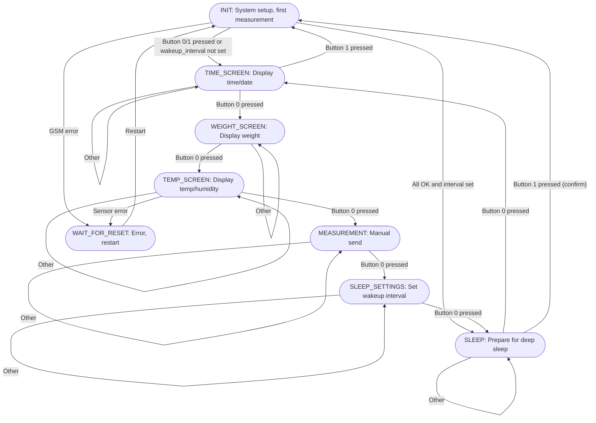

```mermaid
graph TD
    INIT([INIT: System setup, first measurement])
    TIME_SCREEN([TIME_SCREEN: Display time/date])
    WEIGHT_SCREEN([WEIGHT_SCREEN: Display weight])
    TEMP_SCREEN([TEMP_SCREEN: Display temp/humidity])
    MEASUREMENT([MEASUREMENT: Manual send])
    SLEEP_SETTINGS([SLEEP_SETTINGS: Set wakeup interval])
    SLEEP([SLEEP: Prepare for deep sleep])
    WAIT_FOR_RESET([WAIT_FOR_RESET: Error, restart])

    INIT -- "Button 0/1 pressed or wakeup_interval not set" --> TIME_SCREEN
    INIT -- "GSM error" --> WAIT_FOR_RESET
    INIT -- "All OK and interval set" --> SLEEP

    TIME_SCREEN -- "Button 0 pressed" --> WEIGHT_SCREEN
    TIME_SCREEN -- "Button 1 pressed" --> INIT
    TIME_SCREEN -- "Other" --> TIME_SCREEN

    WEIGHT_SCREEN -- "Button 0 pressed" --> TEMP_SCREEN
    WEIGHT_SCREEN -- "Button 1 pressed" --> WEIGHT_SCREEN
    WEIGHT_SCREEN -- "Other" --> WEIGHT_SCREEN

    TEMP_SCREEN -- "Button 0 pressed" --> MEASUREMENT
    TEMP_SCREEN -- "Button 1 pressed" --> TEMP_SCREEN
    TEMP_SCREEN -- "Other" --> TEMP_SCREEN
    TEMP_SCREEN -- "Sensor error" --> WAIT_FOR_RESET

    MEASUREMENT -- "Button 0 pressed" --> SLEEP_SETTINGS
    MEASUREMENT -- "Button 1 pressed" --> MEASUREMENT
    MEASUREMENT -- "Other" --> MEASUREMENT

    SLEEP_SETTINGS -- "Button 0 pressed" --> SLEEP
    SLEEP_SETTINGS -- "Button 1 pressed" --> SLEEP_SETTINGS
    SLEEP_SETTINGS -- "Other" --> SLEEP_SETTINGS

    SLEEP -- "Button 0 pressed" --> TIME_SCREEN
    SLEEP -- "Button 1 pressed" --> SLEEP
    SLEEP -- "Other" --> SLEEP
    SLEEP -- "Button 1 pressed (confirm)" --> INIT

    WAIT_FOR_RESET -- "Restart" --> INIT
```

